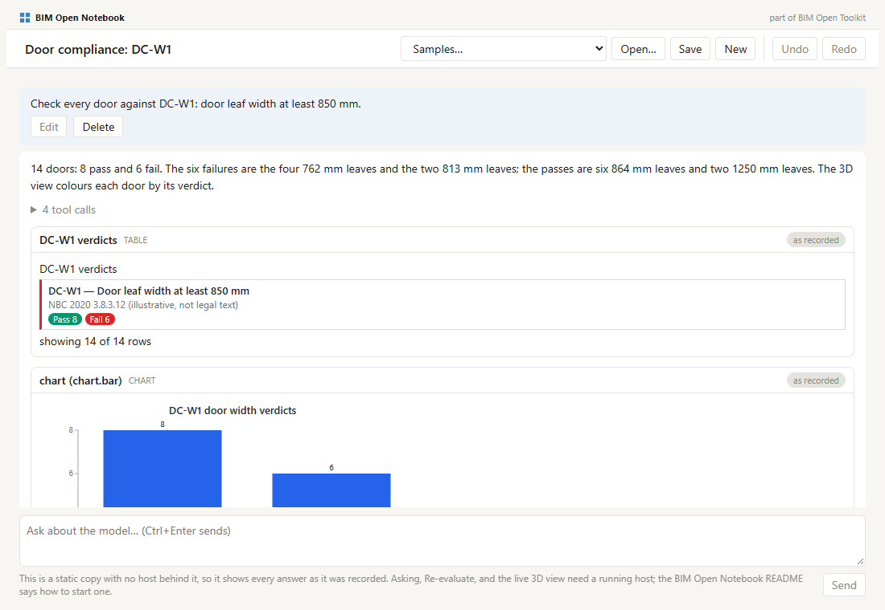

<p></p>

A lab notebook for building models: ask in plain language, keep every answer as evidence you can recheck.

**Try it:** [ara3d.github.io/bim-open-notebook](https://ara3d.github.io/bim-open-notebook/) opens twelve sample notebooks in the browser, with no install and no server.

A BIM Open Notebook records a session with an AI agent about a building model. Each turn is a request written in plain language and the agent's reply. **There are no code cells.** A notebook is a record of what was asked and what came back, not a program you run from top to bottom.



## Who it is for

- **A BIM analyst or manager** who has a converted model and a question, such as a door schedule or the rooms on each storey, and does not write code.
- **A compliance checker** who applies one rule to a model and hands over the failing elements with numbers that can be checked again later.
- **A reviewer** who receives a notebook and wants to see how each number was produced, without installing anything.

## What problem it solves

When an analyst asks an AI agent about a model in a chat window, the answer is text. A number in that text could have come from a query, from the agent's memory, or from a guess, and a week later nobody can tell which. Copying it into a report keeps the number and loses how it was produced.

A notebook keeps the evidence next to the answer. Each reply holds:

- **text**: what the agent did and any doubt it has;
- **tool calls**: each call the agent made to the model's tools, folded under the text;
- **embeds**: the results themselves. An embed is one of seven kinds: a value, a table, a chart, the graph that computed them, a 3D view of the model, a picture, or a file.

Most results come from a **graph**: a small dataflow program of nodes and wires, built by the agent in [BIM Open Toolkit](https://github.com/ara3d/bim-open-toolkit), that reads the model's tables and computes the answer. The graph is the reproducible part of a notebook.

Every embed keeps a **snapshot** of its result in the file, so a notebook opens anywhere, with no server. An embed backed by a graph can be **re-evaluated**: the page asks a running host (the toolkit's server, which holds the model and evaluates graphs) for the current result and marks the embed *current*, *changed* (showing the old and the new value), or *unavailable*.

What it does not do:

- It does not edit graphs. The toolkit's editor does; a notebook shows each graph read-only and links to the editor.
- It does not write files or run anything with side effects. In the toolkit only an explicit Run writes.
- It does not decide whether a building complies. The agent produces data; a verdict comes from running an approved rule, and approving it stays with a person.
- It does not replay the agent. A reply cannot be regenerated exactly, so the notebook stores what the agent said rather than how to say it again.

## How a session reads

From the sample `nrc-eight-questions`, which asks the eight questions of a research paper by the National Research Council Canada (NRC) about the NRC Duplex model and its analytics data:

> **Request:** What is the total operational carbon for the building?
>
> **Reply:** 37,196.2 kgCO2e/yr. The graph sums OperationalCarbon_kgCO2e_per_year over all 218 elements of nrc_analytics_elements.csv.
>
> *3 tool calls:* `getAnalysis` (nrc-q1-building-total: 2 nodes, 1 edge), `evaluate` (2 of 2 nodes Ok), `getResult` (1 row, 2 columns)
>
> *Embeds:* a value (37,196.2 kgCO2e/yr), a table (Total 37196.2, Elements 218), and the two-node graph that computed them.
>
> **Request:** Which storey has the higher mean energy intensity, Level 1 or Level 2?
>
> **Reply:** Level 2, at a mean of 40.56 kWh/m²/yr over 93 elements, against Level 1's 40.50 over 103. The gap, 0.06, is smaller than the one-decimal rounding of the source values, so treat the two as level.

A person reading this later can expand the tool calls, inspect the graph, and, with a host running, press Re-evaluate to see whether 37,196.2 still holds.

## How it differs from Jupyter

| | Jupyter notebook | BIM Open Notebook |
|---|---|---|
| Input cell | code | a request in plain language |
| What runs it | a kernel | an AI agent, with the toolkit's tools |
| Output | text, images, HTML | text, tool calls, and embeds: value, table, chart, graph, 3D view, picture, file |
| Reopening | shows saved outputs; nothing runs until asked | shows the snapshots; each graph embed can be re-evaluated and says whether its result changed |
| Editing an earlier cell | rerun it by hand; cells below go stale without notice | resend the request; the agent answers again from there, the old reply is kept as an earlier version, and later turns are marked stale |
| What is reproducible | the whole notebook, if run in order | the graphs inside it; the transcript is a record |

## Principles

1. **A turn never changes an earlier embed.** "Colour it by class" produces a new 3D view below the grey one; the grey one stays as it was shown. Several embeds may show versions of the same graph.
2. **Selection is shared.** A row picked in a table and an element picked in a 3D view select the same elements everywhere in the notebook, and the agent can read the selection.
3. **The AI produces data, never verdicts.** The agent may draft a query, a graph, or a fact with its source shown. A pass or fail comes from running an approved rule, so it can be replayed and defended.

## Status

BIM Open Notebook is a working prototype. Its code lives in the toolkit today, in [`bimopenflow/web/packages/bim-open-notebook`](https://github.com/ara3d/bim-open-toolkit/tree/main/bimopenflow/web/packages/bim-open-notebook); this repository holds the public site and this description.

Tested:

- The package has 303 unit tests (300 on 2026-10-03 before the static build was added) and a clean type check.
- The twelve sample notebooks open from static files with no page errors, checked in headless Edge before each publish of the site.
- Against a running host, Re-evaluate on the sample notebooks marked every graph-backed embed current: 19 in `nrc-eight-questions` and 56 across nine other sessions, none changed.

Not tested or not working:

- **No live multi-turn session has been recorded.** The request box sends a request to Claude through the Claude Code command line, but every sample was produced another way: the three NRC notebooks were generated from written outlines against a running host, and the other nine are sessions an agent played out. In all twelve the host computed every number in a table, value, or chart.
- **TKT-139:** a 3D embed's legend lists IFC classes instead of the legend of the node that coloured the model.
- **TKT-140:** reply text italicises the part of a word between underscores, so a column name such as `OperationalCarbon_kgCO2e_per_year` renders wrongly.
- On the public site, asking, Re-evaluate, the live 3D view, and the link to the graph editor are off, because no host stands behind it. The page says so in place of the request box.

## Running it with a host

From a clone of [bim-open-toolkit](https://github.com/ara3d/bim-open-toolkit), with its prerequisites installed:

```bash
node scripts/start-bim-flow.mjs --profile tables
npm run dev -w @bimopenflow/bim-open-notebook --prefix bimopenflow/web
```

Then open `http://127.0.0.1:5350/notebook.html`. Asking needs the toolkit's studio host, which serves `/api/ask`; the package README in the toolkit gives the details.

## The public site

`site/` is what GitHub Pages serves:

| Path | Holds |
|---|---|
| `site/index.html` | The landing page: the idea, and the list of samples read from `app/notebooks/catalog.json` |
| `site/app/` | The notebook page, built in the toolkit, with every sample notebook under `app/notebooks/` |

`.github/workflows/pages.yml` publishes `site/` on every push to `main` that changes it.

**Switching it on (owner, once):** Settings, Pages, Build and deployment, Source: GitHub Actions. Then run the Pages workflow from the Actions tab or push a change under `site/`.

**Rebuilding `site/app`** after the notebook code or the samples change in the toolkit. From the toolkit's root:

```bash
npm run build:pages -w @bimopenflow/bim-open-notebook --prefix bimopenflow/web -- --outDir <path to this repository>/site/app --emptyOutDir
```

The build (`vite.pages.config.ts` in the package) uses a relative base, copies every notebook in `samples/notebooks` into `notebooks/`, and writes `notebooks/index.json` and `notebooks/catalog.json`. Commit the result here.

## Roadmap

The code moves into this repository once the editor packages it depends on (the graph canvas, the table, chart, and 3D panes, and the host client) have a home of their own, as the toolkit's repository-split plan describes. Until then, changes to the notebook are made in the toolkit, and this repository receives the built site.

## License

MIT, see [LICENSE](LICENSE).
