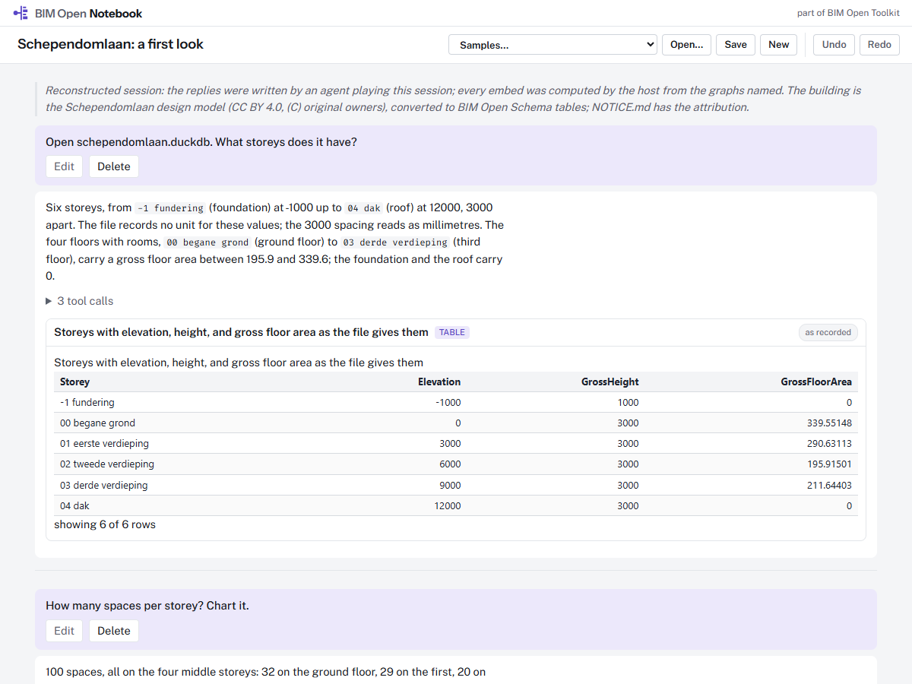
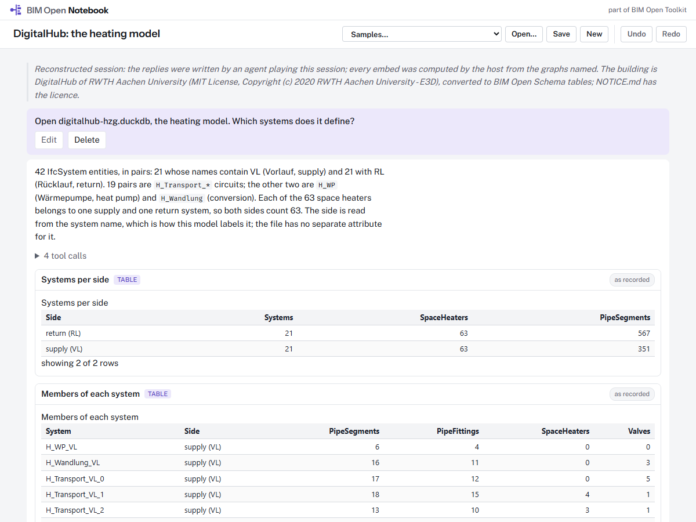
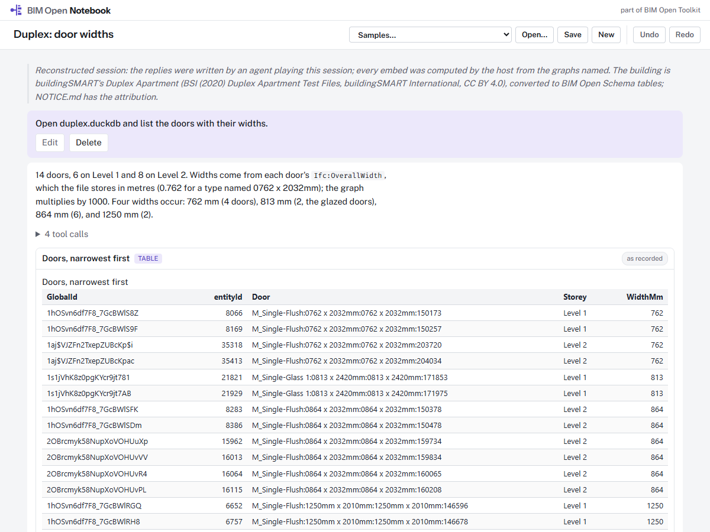
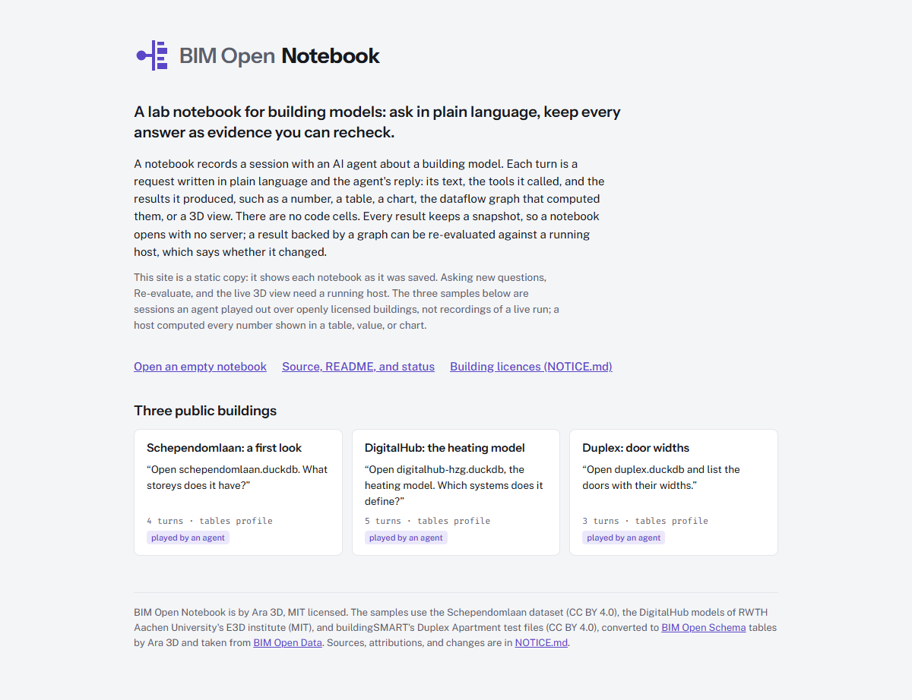
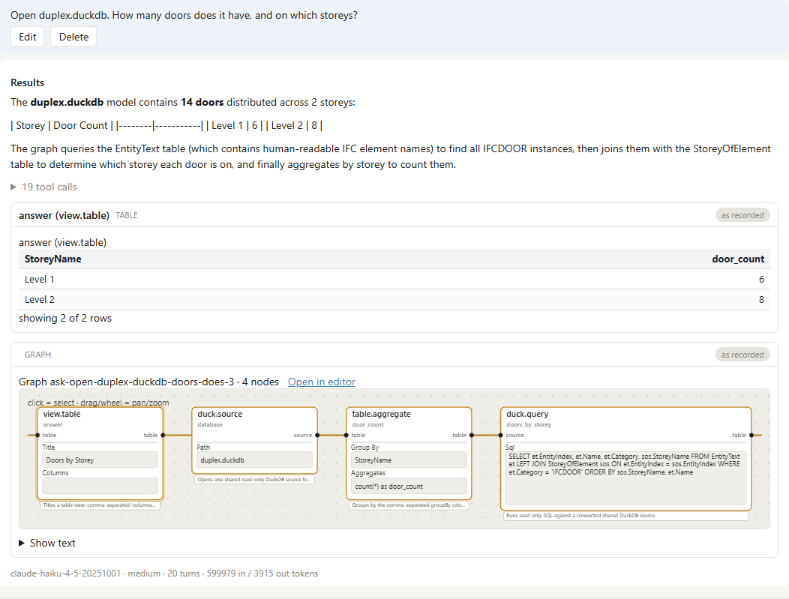

<p></p>

A lab notebook for building models: ask in plain language, keep every answer as evidence you can recheck.

BIM Open Notebook is a web page and a file format for people who ask an AI agent questions about a building model and need to show later where each answer came from. It is a working prototype, built and checked in this repository on 2026-10-04.

**Try it:** [ara3d.github.io/bim-open-notebook](https://ara3d.github.io/bim-open-notebook/) opens the three sample notebooks in the browser, with no install and no server, 3D views included. The same site can be built and checked locally (see [Building it alone](#building-it-alone)).



## What a notebook is

A notebook records a session with an AI agent about one building model. Each turn is a request written in plain language and the agent's reply. **There are no code cells.** A notebook is a record of what was asked and what came back, not a program you run from top to bottom.

A reply holds:

- **text**: what the agent did, and any doubt it has;
- **tool calls**: each call the agent made to the model's tools, folded under the text;
- **embeds**: the results themselves. An embed is one of seven kinds: a value, a table, a chart, the graph that computed them, a 3D view of the model, a picture, or a file.

Most results come from a **graph**: a small dataflow program of nodes and wires that reads the model's tables and computes the answer. The agent builds the graph on a **host**, a local server from [BIM Open Flow](https://github.com/ara3d/bim-open-flow) that holds the models and evaluates graphs. The graph is the reproducible part of a notebook.

Every embed keeps a **snapshot** of its result in the file, so a notebook opens anywhere, with no host. A 3D view keeps every row of its colouring and names its model's geometry file (`models/duplex.bos`, beside the notebook), so it draws without a host too. With a host running, **Re-evaluate** asks it for each graph's current result and marks the embed *current*, *changed* (showing the old and the new value), or *unavailable*.

## What problem it solves

When an analyst asks an AI agent about a model in a chat window, the answer is text. A number in that text could have come from a query, from the agent's memory, or from a guess, and a week later nobody can tell which. Copying it into a report keeps the number and loses how it was produced.

A notebook keeps the evidence next to the answer: the graph that produced each number, the result it gave at the time, and a way to ask the host whether it still gives that result.

## What it does not do

- It does not edit graphs. BIM Open Flow's editor does; a notebook shows each graph read-only and links to the editor.
- It does not write files or run anything with side effects.
- It does not decide whether a building complies. The agent produces data; a pass or fail comes from running an approved rule, and approving the rule stays with a person.
- It does not replay the agent. A reply cannot be regenerated exactly, so the notebook stores what the agent said rather than how to say it again.
- It does not convert IFC (Industry Foundation Classes) files. The host reads models already stored as [BIM Open Schema](https://ara3d.github.io/bim-open-schema/) tables (`.bos` files and DuckDB databases).

## The sample notebooks

The three samples in `samples/notebooks` read openly licensed buildings from [BIM Open Data](https://github.com/ara3d/bim-open-data). Every graph in them uses only the nodes of BIM Open Flow's generic host.

| Notebook | Building | What it asks | Headline numbers |
|---|---|---|---|
| `p01-schependomlaan` | Schependomlaan, a Dutch apartment building | storeys; spaces per storey with a chart; doors and windows per storey; the building in 3D by IFC class | 6 storeys, 100 spaces, 205 doors, 259 windows |
| `p02-digitalhub-heating` | DigitalHub, an office building at RWTH Aachen University, heating model | heating systems; heaters and pipes per storey; pipe diameters; the heating model in 3D | 42 systems, 63 space heaters, 914 pipe segments |
| `p03-duplex-doors` | buildingSMART's Duplex Apartment | doors with widths; which are narrower than 850 mm, in 3D; which heating system serves a room | 14 doors, 8 pass and 6 fail; 0 systems in the MEP (mechanical, electrical, and plumbing) model |

The last turn of `p03-duplex-doors` shows what a notebook does when the data cannot answer: the MEP model defines no heating systems, so the reply says so and shows the counts that prove it, instead of naming a system from room names or positions.





The samples are reconstructed sessions: an agent wrote the requests and replies after reading the results, and the host computed every embed, snapshot, and tool call from the graphs named. Each notebook says so in its header. `samples/notebooks/README.md` describes the outlines they are generated from.

## Who it is for

- **A BIM analyst or manager** who has a converted model and a question, such as a door schedule or the rooms on each storey, and does not write code.
- **A compliance checker** who applies one rule to a model and hands over the failing elements with numbers that can be checked again later.
- **A reviewer** who receives a notebook and wants to see how each number was produced, without installing anything.
- **A developer** extending the notebook's embeds or its page.

It is not yet for anyone who needs a hosted service, more than one user, or a platform other than Windows for the host.

## Building it alone

Prerequisites, as checked on 2026-10-04: Git, Node.js 22 with npm, and, for the page checks, Microsoft Edge. The host commands further down also need Windows and the .NET 8 SDK or later (the host targets `net8.0-windows`).

```bash
git clone https://github.com/ara3d/bim-open-notebook
cd bim-open-notebook
node deps.mjs
cd deps/bim-open-viewer && npm ci && npm run build && cd ../..
cd bimopenflow/web && npm ci && cd ../..
node gates/web-smoke.mjs
node gates/pages-smoke.mjs
```

`node deps.mjs` clones the repositories `deps.json` pins (BIM Open Flow, BIM Open Viewer, Gratify, BIM Open Data, and their own pins) into `deps/`, which git ignores; it took 34 s. The viewer is built first because three of its packages are used from their built `dist/` folders. `gates/web-smoke.mjs` runs the tests and the type check of both packages (pane-3d 81 tests, the notebook 282) and builds the static site into `site/app`, copying the three sample buildings' `.bos` files (2.2 MB together) in beside the notebooks. `gates/pages-smoke.mjs` serves `site/` as plain files, opens the landing page and each notebook in headless Edge, and fails on a page error, a failed request, a notebook that draws fewer turns than its catalog entry, a 3D view that does not draw its recorded model, or a missing link to `NOTICE.md`. A pass ends with `PAGES SMOKE: PASS`.



## Running it with BIM Open Flow's host

The generic host serves the public buildings and evaluates graphs; it has no AI agent. Run these from the repository root in PowerShell, after the steps above. The paths are absolute because the host resolves a relative path against its own project folder.

```powershell
dotnet run --project deps/bim-open-flow/src/flow/BimOpenFlow.Host -c Release -- --profile tables --models "$PWD/deps/bim-open-data/samples/public" --port 5431 --store "$PWD/artifacts/host/store" --cache "$PWD/artifacts/host/cache"
```

The first run builds the host. It is ready when `http://127.0.0.1:5431/api/models` lists 11 models.

A new store holds none of the samples' graphs, so Re-evaluate has nothing to ask for until the graphs are saved to the host (a 3D view then says it is showing the recorded view, and why). The script that generated the samples does that; `--out` sends its copy of each notebook to `artifacts/regen` so the committed files stay as they are. In a second terminal:

```powershell
mkdir artifacts/regen
cd bimopenflow/web/packages/bim-open-notebook
foreach ($n in "p01-schependomlaan", "p02-digitalhub-heating", "p03-duplex-doors") {
  npx vite-node scripts/write-sample-notebooks.ts -- --host http://127.0.0.1:5431 --outline ../../../../samples/notebooks/outlines/$n.outline.json --placeholder PUBLIC=../../../../deps/bim-open-data/samples/public --out ../../../../artifacts/regen
}
cd ../../../..
```

Then start the page against that host:

```powershell
$env:BOF_HOST = "http://127.0.0.1:5431"
npm run dev -w @bimopenflow/bim-open-notebook --prefix bimopenflow/web
```

Open `http://127.0.0.1:5354/notebook.html` and choose a sample. Re-evaluate now works and the 3D views are fed by the host rather than from the recorded rows. The request box stays off, because this host serves no agent, and the Open in editor links need BIM Open Flow's editor, which these steps do not start.


## Asking through BIM Open Toolkit's studio host

Asking needs a host that also serves `/api/ask`. That host, `BimOpenFlow.Studio`, lives in [BIM Open Toolkit](https://github.com/ara3d/bim-open-toolkit), not here. It calls Claude through the Claude Code command line, which must be installed and logged in (`npm install -g @anthropic-ai/claude-code`, then `claude` and `/login`). From a toolkit clone prepared as its README describes, point it at this repository's public buildings:

```powershell
dotnet run --project src/studio/BimOpenFlow.Studio -c Release -- --profile tables --models "<this repository>/deps/bim-open-data/samples/public" --port 5441 --store "<this repository>/artifacts/studio/store" --cache "<this repository>/artifacts/studio/cache"
```

`http://127.0.0.1:5441/api/ask/model` says which model it will use and whether it is configured. Save the samples' graphs to it as above (with `--host http://127.0.0.1:5441`), then start the page with `$env:BOF_HOST = "http://127.0.0.1:5441"`. The request box is now on. A new turn arrives with the reply text, the tool calls, and an embed for each answer node of the graph the agent built:



## Status

Tested on 2026-10-04, in a fresh clone on Windows 11:

- Every command in [Building it alone](#building-it-alone) and [Running it with BIM Open Flow's host](#running-it-with-bim-open-flows-host) ran as written. Both smokes passed: 3 notebooks with 4, 5, and 3 turns, and the three 3D views drew their bundled models (5,972, 4,119, and 660 rendered instances) in headless Edge.
- Against the generic host, Re-evaluate marked 8 of 9 embeds current in `p01-schependomlaan`, 8 of 9 in `p02-digitalhub-heating`, and 7 of 8 in `p03-duplex-doors`; the three that were not are explained below. The live 3D view of the Duplex doors drew 660 instances with the 14 doors coloured.
- The studio host ran from the toolkit's own checkout, not a fresh clone. Three requests about the Duplex doors each produced a reply with 14 doors (6 on Level 1, 8 on Level 2), a table, and a graph, using Claude Haiku 4.5. Two were timed: 21 and 54 seconds to the first embed.
- `.github/workflows/build.yml` runs the build and the web smoke on every push. `.github/workflows/pages.yml` is set to build the site, run the pages smoke with Chrome, and publish `site/` on every push to `main`; no run of it has been checked.

Not tested or not working:

- **No live multi-turn session has been recorded.** All three samples are reconstructed.
- **A graph embed reports "changed" in any other checkout.** The host saves each graph with the data folder's absolute path, which enters the graph's hash, so the hashes recorded on the machine that generated the samples differ from a fresh clone's (one embed each in `p01` and `p03`). The graph's results are unchanged.
- **The pipe lengths in `p02` report "changed"** because the host's sums differ in the last digits from run to run (31623.880864000006 against 31623.880864), and Re-evaluate compares numbers exactly.
- In the static copy, a graph embed draws its nodes without wires, because the wires need the node catalog that only a host provides.
- In the static copy, picking an element in a 3D view selects it but shows no property sets, because the entity index behind them lives on the host.
- Reply text renders a small Markdown subset with no tables, so a Markdown table in a reply shows as literal `|` characters.
- The host and the studio host run on Windows only.

## How it differs from Jupyter and from a chat transcript

| | Jupyter notebook | Chat transcript | BIM Open Notebook |
|---|---|---|---|
| Input | code | plain language | plain language |
| What runs it | a kernel | the AI service | an AI agent, with the host's tools |
| Output | text, images, HTML | text | text, tool calls, and seven kinds of embeds |
| Reopening | shows saved outputs; nothing runs until asked | shows the text | shows the snapshots; each graph embed can be re-evaluated and says whether its result changed |
| What is reproducible | the whole notebook, if run in order | nothing | the graphs inside it; the transcript is a record |

Jupyter AI and similar extensions add an AI assistant to a code notebook; the cells they produce are still code. This comparison was written on 2026-10-04 and may go stale as those tools change.

## Repository layout

| Path | Holds |
|---|---|
| `bimopenflow/web/packages/bim-open-notebook` | The notebook package: file format, embeds, page, Vite plugins, the sample-writing script, and its README |
| `bimopenflow/web/packages/pane-3d` | The 3D pane over BIM Open Viewer, used by the notebook's 3D embed and by the toolkit's editor pages |
| `samples/notebooks` | The three sample notebooks, their outlines, and their graphs |
| `site/index.html` | The landing page of the static site; `site/app` is built, not committed |
| `gates/` | `web-smoke.mjs` (tests, type checks, site build) and `pages-smoke.mjs` (the built site in a headless browser) |
| `docs/` | The brand files, the design proposal (`proposals/notebook-sessions.md`), the plan (`plans/notebook.md`), and these screenshots |
| `deps.json`, `deps.mjs` | The pinned repositories and the script that fills `deps/` |
| `NOTICE.md` | Sources, licences, and attributions of the sample buildings |

BIM Open Toolkit takes both packages from this repository through its own `deps/` and serves its own notebook page with its NRC (National Research Council Canada) samples.

## Licences

Ara 3D's code is MIT licensed; see [LICENSE](LICENSE). The sample buildings keep their own licences: Schependomlaan and the Duplex Apartment are CC BY 4.0, and DigitalHub is MIT. [NOTICE.md](NOTICE.md) gives the source, licence, and attribution of each, and the static site carries a copy beside the notebook page.
